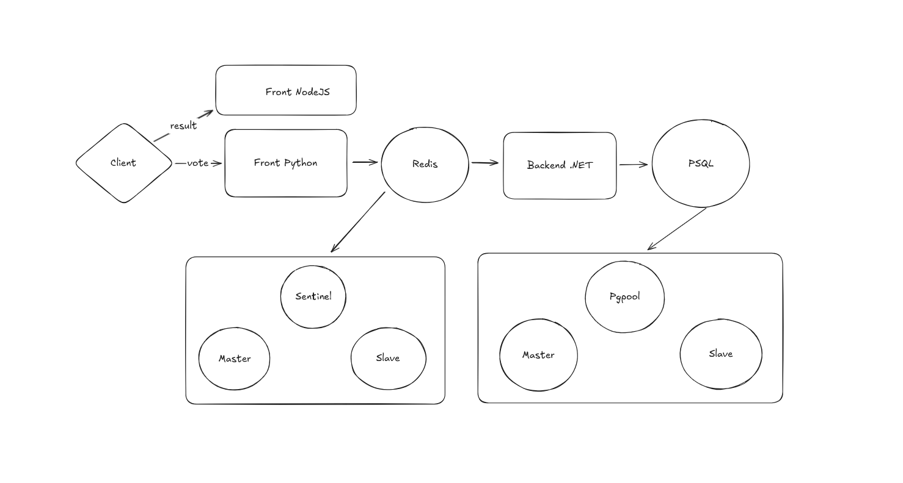

# Session 1
## Hardening_Server — Ansible playbooks for opinionated Linux hardening

`Hardening_Sever` is an Ansible codebase that applies a baseline security posture to Debian/Ubuntu hosts. It exposes a reusable roles:

- **`hardening`** — OS-level lockdown covering sysctl, PAM, auditd, cron, authentication defaults, filesystem blacklisting, and legacy service removal.

Use the provided playbooks to roll out the baseline to fresh hosts or incorporate the roles into your own automation.

---

## Repository layout

| Path | Description |
| ---- | ----------- |
| `ansible.cfg` | Opinionated Ansible defaults (local inventory path, pipelining, host key checking disabled) for faster ad-hoc runs. |
| `inventory/inventory.yml` | Example inventory targeting the `servers` group. Replace host definitions with your infrastructure. |
| `playbooks/hardening.yml` | Entry point that applies the full operating-system hardening role to the `servers` group. |
| `roles/hardening/` | Reusable OS hardening role (tasks, templates, defaults, handlers). |


---

## Prerequisites

1. **Control node**
   - Create virtual env 
   - Ansible 2.12+ (tested with modern releases).
   - Python 3.x with `ansible-galaxy` available.
   - Create roles with ansible galaxy 

2. **Managed hosts**
   - Debian/Ubuntu family (the defaults assume APT, `/etc/login.defs`, PAM profiles, etc.).
   - SSH connectivity with an account that can `become: true` (role touches system files).
   - Package repositories reachable to install baseline packages (e.g., `auditd`, `libpam-passwdqc`).

---

## Quick start

1. Update the example inventory:

```yaml
all:
  children:
    servers:
      hosts:
        server_group1:
          ansible_host: ""
          ansible_user: ""
          ansible_port: ""
   ```

2. (Optional) Test connectivity:

   ```bash
   ansible -i inventory/inventory.yml servers -m ping
   ```

3. Run the baseline OS hardening:

   ```bash
   ansible-playbook -i inventory/inventory.yml playbooks/hardening.yml
   ```


---

## What the roles do

### OS hardening (`roles/hardening`)

Key actions include:

- Refresh package cache, install baseline security packages (`openssh-server`, `auditd`, `libpam-modules`, `libpam-passwdqc`), and purge legacy daemons such as `telnetd`/`rsh`/`xinetd`.
- Apply kernel/network sysctl defaults sourced from `defaults/main.yml` via `templates/sysctl-hardening.j2`, then trigger `sysctl --system` reloads.
- Lock down scheduled task infrastructure: secure `/etc/cron.*` directories, set restrictive permissions on `/etc/crontab`, remove `cron.deny`/`at.deny`, and maintain `cron.allow`/`at.allow` lists.
- Normalize permissions on `/etc/passwd`, `/etc/group`, `/etc/shadow`, `/etc/gshadow`.
- Configure auditd with opinionated defaults (`templates/auditd.conf.j2`) and restart the service when needed.
- Enforce PAM password complexity (`templates/pam_passwdqc.j2`) and faillock policies (`faillock` defaults and `community.general.pamd` edits).
- Manage `/etc/login.defs` guardrails (password rotation, retries, UMASK) and disable core dumps through `/etc/security/limits.d/hardening.conf`.
- Set a global `umask 027` profile, blacklist uncommon filesystems (`templates/filesystems.conf.j2`), and ensure handlers reload/restart services as appropriate.

All tunables are exposed in `defaults/main.yml`; override them in inventory/group vars to adapt to your policy.

---
# Session 2 - SSH
## Hardening SSH
* Restricts supported ciphers, MACs, and key exchange algorithms.
* Configures banner text, login grace period, and max authentication attempts.
* Validates changes with `sshd -t` before applying the configuration.

### SSH hardening (`roles/SSH_hardening`)

The SSH-specific role:

- Ensures `/run/sshd` exists and stops systemd socket activation (`ssh.socket`) so sshd runs as a traditional service.
- Deploys `templates/sshd_config.j2`, populated by defaults such as strong cipher/MAC/KEX suites, root login policy, session limits, and logging verbosity.
- Creates an empty revoked-keys list and guarantees the classic `ssh` service is enabled/restarted via the role handler.

Customize behavior through `defaults/main.yml` (e.g., `sshd_port`, crypto suites, login controls) or override per-host.

## What the roles do

* Creates /run/sshd with secure permissions so that the SSH daemon can start reliably. 

* Deploys a hardened sshd_config to /etc/ssh/sshd_config from the sshd_config.j2 template:

* Validates the configuration with sshd -t -f before applying it.

* Sets root ownership and 0600 permissions.

* Keeps a backup of the previous configuration.

* Notifies a handler to restart SSH when the configuration changes.

* Ensures a revoked keys file exists at the path defined by sshd_revoked_keys_file (default: /etc/ssh/revoked_keys) with appropriate permissions.

* Configuration is driven by variables, allowing you to tune SSH hardening:

* Basic settings

* sshd_port: SSH listening port (default: 22).

* sshd_host_keys: List of host key files (ed25519 & RSA).

* Authentication

* sshd_permit_root_login: Controls if root login is allowed.

* sshd_password_authentication: Disables password-based auth.

* sshd_kbd_interactive_authentication, sshd_challenge_response_authentication: Disable legacy interactive methods.

* sshd_pubkey_authentication: Enables public key authentication.

* Session & forwarding restrictions

* sshd_x11_forwarding, sshd_allow_agent_forwarding,

* sshd_allow_tcp_forwarding, sshd_permit_tunnel,

* sshd_allow_stream_local_forwarding, sshd_permit_user_environment:

* All disabled to reduce attack surface.

* Connection limits & timeouts

* sshd_client_alive_interval, sshd_client_alive_count_max: Idle session timeouts.

* sshd_login_grace_time: Time allowed for authentication.

* sshd_max_auth_tries: Limits failed auth attempts.

* sshd_max_sessions: Limits concurrent sessions per connection.

* PAM and login banners

* sshd_use_pam: Enables PAM integration.

* sshd_print_motd, sshd_print_last_log: Control MOTD and last login message.

* Networking & DNS

* sshd_use_dns: Disables reverse DNS lookups to speed up logins.

* Cryptography (aligned with DevSec recommendations)

* sshd_ciphers: Restricts SSH to modern, strong ciphers (chacha20, AES-GCM, AES-CTR).

* sshd_macs: Restricts MACs to SHA-2 based algorithms.

* sshd_kex: Restricts key exchange algorithms to strong, modern groups (curve25519, ECDH, strong DH groups).

* Logging and SFTP

* sshd_syslog_facility: Uses AUTHPRIV for sensitive auth logs.

* sshd_log_level: Uses VERBOSE to capture more detailed SSH activity.

* sshd_revoked_keys_file: Path to the file containing revoked public keys.

* sshd_subsystem_sftp: Uses the built-in internal-sftp subsystem.

---

### Run the baseline SSH hardening:

   ```bash
   ansible-playbook -i inventory/inventory.yml playbooks/SSH.yml
   ```
---
# Session 2 - Docker 

## What the role do

# Docker Installation Ansible Role

This Ansible role automates the installation and configuration of **Docker** and **Docker Compose** on Ubuntu-based systems.
It ensures that all required dependencies, repositories, and binaries are properly installed and up to date.

## Features

* Updates and upgrades APT packages
* Installs required Docker dependencies
* Adds Docker’s official GPG key and repository
* Installs Docker Engine, CLI, and containerd
* Downloads and installs the latest Docker Compose release directly from GitHub
* Includes a handler to restart Docker when needed

---

## Tasks Overview

### 1. **Update and upgrade apt packages**

Updates the APT cache and upgrades existing system packages to ensure the system is prepared for Docker installation.

### 2. **Install dependencies**

Installs essential packages needed for Docker installation such as:

* `apt-transport-https`
* `curl`
* `ca-certificates`
* `gnupg-agent`
* `software-properties-common`

These packages allow the system to handle HTTPS repositories and manage GPG keys.

### 3. **Give Docker GPG key**

Downloads and adds Docker’s official GPG key to the system so that package authenticity can be verified.

### 4. **Add Docker repository**

Adds Docker’s stable repository for Ubuntu (`bionic` in this example) to APT sources so that the latest official Docker packages can be installed.

### 5. **Install Docker**

Installs:

* `docker-ce`
* `docker-ce-cli`
* `containerd.io`

This ensures a complete Docker installation including the CLI and container runtime.

### 6. **Update repo list**

Refreshes the APT cache after adding the Docker repository.
Triggers a handler to restart Docker if changes occur.

### 7. **Fetch latest Docker Compose release**

Queries the Docker Compose GitHub API to retrieve the tag name of the latest release.

### 8. **Install or upgrade Docker Compose**

Downloads the corresponding Docker Compose binary and places it in `/usr/local/bin/compose` with executable permissions.

---
# Session 3 - Gitlab

### Ansible Playbook for GitLab Docker Deployment

This Ansible playbook automates the setup and deployment of a self-hosted GitLab instance using Docker Compose. It also configures a daily cron job to ensure regular backups of the GitLab instance.

## Overview

The primary goal of this project is to provide a simple and repeatable way to deploy GitLab. The playbook performs the following actions:
1.  Creates a project directory on the target host.
2.  Copies necessary files (like `compose.yml` and `.env`) to the project directory.
3.  Secures the `.env` file by setting strict file permissions.
4.  Deploys GitLab using Docker Compose, always pulling the latest image.
5.  Schedules a daily backup of the GitLab data using a cron job.

## Prerequisites

### Control Node
*   Ansible 2.10+

### Target Host
*   A user with `sudo` privileges.
*   Docker Engine.
*   Docker Compose V2 plugin.
*   Python 3.x (required for Ansible modules).

## Configuration

Before running the playbook, you need to configure the deployment variables.

1.  **Ansible Variables**:
    Set the following variables in your inventory file or as extra-vars:
    *   `project_path`: The absolute path on the target host where the GitLab project files will be stored (e.g., `/var/gitlab`).
    *   `role_path`: The path to the Ansible role containing the playbook tasks and files.

2.  **Project Files**:
    Place the following files in the `files/` directory within your Ansible role:
    *   `compose.yml`: Your Docker Compose file that defines the GitLab service and any related containers. The GitLab service should be named `gitlab` for the backup command to work correctly.
    *   `.env`: An environment file containing sensitive data or environment-specific configurations for your Docker Compose setup (e.g., GitLab root password, domain name, etc.).

## Usage

To run the playbook, use the `ansible-playbook` command and specify your inventory file.

```bash
ansible-playbook -i your_inventory.yml playbooks/YOUR_PLAYBOOK
```
---

# Session 3 - Runner
## Ansible Playbook for GitLab Runner Deployment

This Ansible playbook automates the installation and registration of a GitLab Runner on a target host. It allows you to quickly add new runners to your GitLab instance (self-hosted or gitlab.com) for running CI/CD jobs.

## Overview

The playbook performs the following key steps:
1.  **Repository Setup**: Adds the official GitLab Runner package repository to the system.
2.  **Installation**: Installs the `gitlab-runner` package.
3.  **Registration**: Registers the runner with a GitLab instance non-interactively using a registration token.
4.  **Service Management**: Ensures the `gitlab-runner` service is started and enabled on boot.

## Prerequisites

### Control Node
*   Ansible 2.10+
*   Ansible collections `community.general` might be required for certain modules.

### Target Host
*   A Debian-based (e.g., Ubuntu) or RHEL-based (e.g., CentOS) Linux distribution. The playbook examples provided are for Debian-based systems.
*   A user with `sudo` privileges.
*   Network access to the GitLab instance.
*   **Docker (Optional)**: If you plan to use the `docker` executor, Docker must be installed and running on the target host.

## Configuration

To run this playbook, you must configure the following variables. It is **strongly recommended** to use Ansible Vault to encrypt sensitive values like `registration_token`.

| Variable               | Description                                                                                                                                     | Example Value                     |
| ---------------------- | ----------------------------------------------------------------------------------------------------------------------------------------------- | --------------------------------- |
| `gitlab_url`           | The URL of your GitLab instance.                                                                                                                | `"https://gitlab.com/"`           |
| `registration_token`   | The runner registration token. You can find this in your GitLab project or group under **Settings > CI/CD > Runners**.                            | `"your_secret_token_here"`        |
| `runner_description`   | A description for the runner that will appear in the GitLab UI.                                                                                 | `"Ansible Deployed Docker Runner"`  |
| `runner_tags`          | A comma-separated list of tags for the runner, used to specify which jobs it can run.                                                           | `"docker,linux,production"`       |
| `runner_executor`      | The executor to use for running jobs. Common choices include `shell`, `docker`, `kubernetes`.                                                     | `"docker"`                        |
| `docker_default_image` | (Optional) The default Docker image to use if the executor is `docker` and a job does not specify an image.                                       | `"ruby:2.7"`                      |

You can define these variables in your inventory, a group variables file (`group_vars/all.yml`), or pass them as extra-vars.

### Example Variables File (`group_vars/all.yml`)
```yaml
---
# GitLab Runner Configuration
gitlab_url: "https://gitlab.com/"
registration_token: "{{ vault_registration_token }}" # Stored in Ansible Vault
runner_description: "Ansible Deployed Docker Runner"
runner_tags: "docker,linux,production"
runner_executor: "docker"
docker_default_image: "ubuntu:20.04"
```
---
# Session 4 - Nexus 

### Nexus Repository Manager (Docker) Provisioned with Ansible

This project provisions **Sonatype Nexus Repository Manager** using **Docker Compose** and configures a **Docker Hosted repository** automatically via **Ansible**.

---

## What this automation does

The Ansible role performs these steps:

1. **Creates the project directory** on the target host (`{{ project_path }}`).
2. **Copies the entire role `files/` directory** into the project directory.
3. **Brings up the Nexus stack** using Docker Compose v2 (`compose.yml`).
4. **Creates a Docker Hosted repository** in Nexus using the REST API:
   - Repository name: `docker-hosted`
   - HTTP port: `8083`
   - `forceBasicAuth: true`
   - `v1Enabled: false`

---

## Requirements

- Ansible installed on the control machine
- Target host:
  - Docker Engine installed
  - Docker Compose v2 installed
- Ansible collection:
  - `community.docker`

Install the collection:
```bash
ansible-playbook playbook/nexusSetup.yml -i inventory/inventory.yml
```
# Session 5-6 Deploy Voting-app

## Voting App Architecture



The **Voting App** is a demonstration of a modern cloud-native application, structured around microservices to ensure scalability, high availability, and resilience. The architecture is optimized to run in a Docker environment, leveraging containerized services and cloud-native patterns to deliver a fault-tolerant voting platform.

This app includes a collection of microservices that work together to create a seamless voting experience. With **PostgreSQL** as the persistent database and **Redis** for fast in-memory storage and message brokering, the infrastructure is built to handle real-time voting processes efficiently.

## Project Overview

The Voting App is a sample application developed to demonstrate:

- **Microservices Architecture**: Each service runs independently, scaling as needed based on workload.
- **Service Orchestration**: Managed through Docker , which ensures automatic recovery, scaling, and deployment of services.
- **Resilient Data Management**: Combining PostgreSQL and Redis to manage both temporary and permanent data storage with high availability.
- **Dynamic Service Discovery**: Traefik, a dynamic reverse proxy, automatically routes and balances traffic across services, providing HTTPS termination and security through Let's Encrypt.

## Services Overview

- **Vote Service**: A front-end web application where users can cast votes. It serves as the user-facing entry point of the app.
- **Worker Service**: A .NET-based background processor that consumes votes from Redis and stores them in the PostgreSQL database.
- **Result Service**: A Node.js application responsible for displaying real-time voting results, showing users how the voting trends are shaping up.
- **PostgreSQL Database**: Manages permanent storage of voting results. Configured for high availability with replication and failover.
- **Redis Cluster**: Handles temporary storage of vote data and acts as a message broker between the vote and worker services for efficient processing.

## Infrastructure Details

### 1. Traefik as Reverse Proxy

**Traefik** is used for dynamic service discovery and routing within the Docker environment. It manages incoming requests, balancing them across services based on traffic and availability.

- **SSL Support**: Traefik automatically generates and manages SSL certificates through Let's Encrypt, ensuring all communication is secure.
- **Service Routing**: It defines routing rules for services based on hostnames, ensuring traffic is directed to the appropriate service (Voting or Results).

### 2. PostgreSQL as Database Backend

PostgreSQL is deployed with high availability using Bitnami’s PostgreSQL image, enhanced with **Replication Manager (repmgr)** to ensure automatic failover.

- **Replication**: Set up as master-slave replication to ensure data redundancy and prevent data loss.
- **Pgpool**: This component balances the load across the database nodes, handling multiple concurrent connections and improving performance.

### 3. Redis for Caching and Message Brokering

Redis operates as both a caching layer and a message broker, using a master-slave architecture to ensure reliability and fast data access.

- **High Availability**: Redis Sentinel monitors the health of the nodes and automatically promotes a slave to master in case of failure.
- **Load Balancing**: **HAProxy** is used to distribute the load across Redis instances, maximizing efficiency and response times.

## Key Features of the Voting App

- **Microservices-Based**: Each service is independently deployable, allowing the infrastructure to scale efficiently.
- **Scalable and Resilient**: With Docker managing service orchestration, the app is highly available and capable of handling increased traffic without downtime.
- **High Availability**: PostgreSQL and Redis are configured with high-availability mechanisms like replication and failover to ensure data is always accessible and the app remains operational.
- **HTTPS Security**: Secure communication between users and services is ensured through Traefik’s integration with Let's Encrypt for automatic certificate management.


